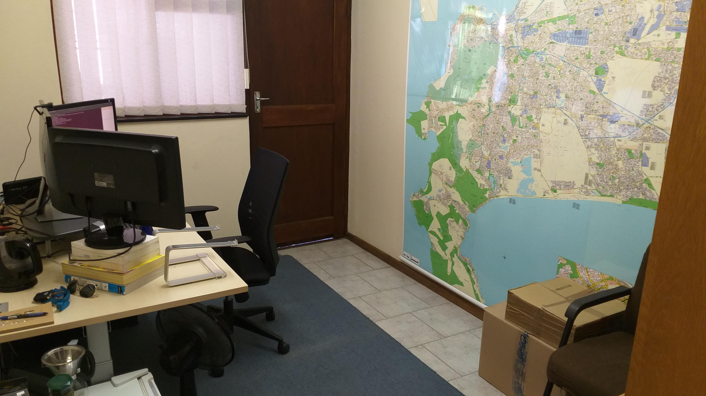
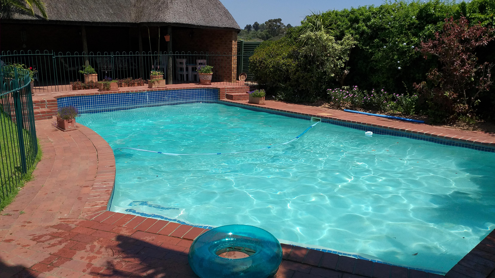
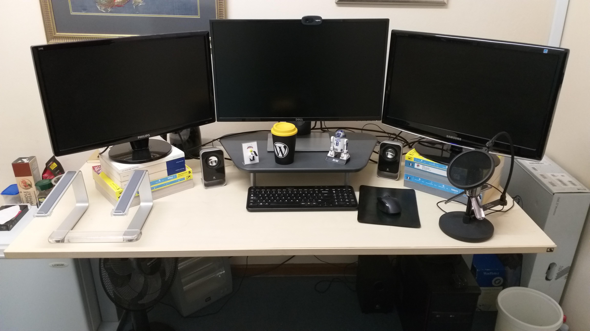

# Jonathan

Hi, my name is Jonathan and I am a freelance web developer. You can read more about me on my [blog](https://jonathanbossenger.com).

## Office

When I originally went freelance I tried working from home with my two boys (then aged 1 and 4). This didn't last long, and since September 2017 I've been working out of a small office space about 5 minutes from where I live.

It's great because I get my own space, and the commute takes me directly past a Vida, Xpresso and Seattle, so I can mix up my morning coffee flavours. It also has this full wall size map of the Cape Peninsual, which is a talking point whenever I have video calls with folks from outside Cape Town.

The other great advantage of my office is that it's actually part of my in-laws home office, which means I get to enjoy their pool whenever the summer sun get's too much.

My desk is a 2nd hand adjustable desk and I have an AllOffice Accent chair, which is a cost effective ergonomic office chair. Next to my desk I have a small fridge and coffee making requirements.

## Hardware

Under my desk is a custom built workstation, powered by a MSI x470 gaming motherboard, 6 core AMD Ryzen 5 2600x, 16GB of DDR4 RAM and a Zotac Geforce GTX 1060. OS is taken care of by two 128 GB M.2 SSD hard drives dual booting Ubuntu and Windows, with two 1 TB hard drives for storage for each OS. 

My peripherals include a Dell 27 inch LED, my 7 year old Samsung 23 inch Syncmaster and a Philips 24 inch monitor I picked up recently. I'm a bit of a Logitech fan boy, so my wireless mouse, keyboard, 2.1 speakers, webcam and headset are all Logitech products, purchased at separate times over the course of the last 10 years or so. I also have a Samson mic for meetings and podcast recordings.

My main OS is Ubuntu 18.04 LTS, and I generally stick to the LTS version unless something cool is coming out on a newer version. The Windows 10 install is mostly for gaming (those games that don't work via Steam on Linux) or if I need to test something in a true Windows environment.

When I'm travelling to meetings or conferences I have a Dell Inspiron 7566 laptop, which is powered by a Core i7 i7-6700HQ, (upgraded to) 16GB RAM and a nVidia GeForce GTX 960M graphics card. I took the 128GB M.2 SSD out of the laptop for the desktop and installed Ubuntu on the 500 GB SSD as the main OS.

My mobile is usually whatever mid range Samsung is available on contract, currently it's a Samsung Galaxy A6.

## Environment

I spend half of my day developing in Laravel and the other half developing for WordPress. Because I'm on Linux I can't use Laravel Valet, so I use the Homestead Vagrant box for Laravel and my own pre build Vagrant box for WordPress. 

## Editor

Because I work in (what I like to call the four horsemen of the web) PHP/HTML/CSS & JavaScript, but mainly PHP, my editor of choice is PHPStorm, using the Material Darker theme. I use the built in Ubuntu terminal

## Communication

Most of my communication happens via Slack or email. Freelance client communication is handled within the Codeable app. 

## Other tools
* Chrome & Firefox (browser)
* Simplenote (Cloud Synced Notes)
* Google Calender (Calendar)
* Dropbox (Cloud File Storage)
* GMail (Mail Client)
* MySQL Workbench (Database Admin)
* Spectacle (Window Management)
* Trello (Todo's)
* Toggl (Time tracking)
* Google Play (Music)
* Steam (relaxation time)
