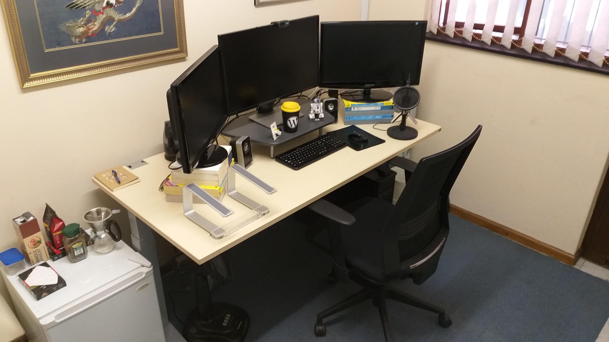

# Jonathan

Hi, my name is Jonathan and I am a freelance web developer. I spend half my time working on [Castos](https://castos.com/) and [Seriously Simple Podcasting](https://castos.com/seriously-simple-podcasting/) and the other half doing ad hoc WordPress development for clients on [Codeable](https://codeable.io/).  You can read more about me on my [site](https://jonathanbossenger.com).

## Office

When I originally started freelancing I tried working from home. With my two boys (then aged 1 and 4) at home in the afternoons, this didn't last long. Fortunately since September 2017 I've been working out of a small office space about 5 minutes from where I live.

The morning commute takes me directly past a Vida, Xpresso and Seattle, so I can mix up my morning coffee flavours. The office has a wall size street map of the Cape Peninsula, which is a talking point whenever I have video calls with folks from outside Cape Town and provides fun conversations when my 6 year old comes to visit.

The other advantage of my office is that because it's actually at the back of my father-in-law's home office, I get to enjoy the pool whenever the Cape Town weather gets too hot. This is helpful as the office itself has no air conditioning.

My desk is a 2nd hand adjustable that I've made slightly higher then a standard office desk and I have an AllOffice Accent, which is a cost effective ergonomic office chair. Next to my desk I have a small bar fridge and coffee making equipment.

## Hardware

Under my desk is a custom built workstation, powered by a MSI x470 gaming motherboard, 6 core AMD Ryzen 5 2600x, 16GB of DDR4 RAM and a Zotac Geforce GTX 1060. OS is taken care of by two 128 GB M.2 SSD hard drives dual booting Ubuntu and Windows, with two 1 TB hard drives for storage for each OS. This handles every thing I throw at it, including some down time gaming between work sessions.

My peripherals include a Dell 27 inch LED, my 7 year old Samsung 23 inch Syncmaster and a Philips 24 inch monitor I picked up recently. The side monitor stands are a combination of phone books and Dos 6.2, Windows 3.1, and Office manuals I found in the office when I moved in. 

I'm a bit of a Logitech fan, so my wireless mouse, keyboard, 2.1 speakers, webcam and headset are all Logitech products, purchased at separate times over the course of the last 10 years or so. I also have a Samson mic for meetings and podcast recordings.

My main OS is currently Ubuntu 18.04 LTS, and I generally stick to the LTS version unless something cool is coming out on a newer version. The Windows 10 install is mostly for gaming (those games that don't work via Steam on Linux) or if I need to test something in a true Windows environment.

When I'm travelling to meetings or conferences I have a Dell Inspiron 7566 laptop, which is powered by a Core i7 i7-6700HQ, (upgraded to) 16GB RAM and a nVidia GeForce GTX 960M graphics card. I took the 128GB M.2 SSD out of the laptop for the workstation and installed Ubuntu on the 500 GB SSD as the main OS.

My mobile is usually whatever mid range Samsung/Android is available on contract, currently it's a Samsung Galaxy A6.

## Environment

I spend half of my day developing in Laravel and the other half developing for WordPress. Because I'm on Linux I can't use Laravel Valet, so I use a combination of [Laravel Homestead](https://laravel.com/docs/5.7/homestead) and my own [pre build Vagrant box](https://jonathanbossenger.com/introducing-boss-box-a-wordpress-ready-development-environment/).

## Virtualisation

Because I am on Linux, if I quickly need to test anything in a Windows or Mac environment I have a bunch of prebuilt VirtalBox machines configured. This is probably also the reason I tend to stick to Vagrant for my development environments.

## Editor

Because I work in (what I like to call the four horsemen of the web) PHP, HTML, CSS & JavaScript, but mainly PHP, daily my editor of choice is PHPStorm, using the Material Darker theme. If I need to code in any thing else I use Visual Code Studio. 

## Terminal

I generally use the build in PHPStorm terminal when I'm working in a specific project and the default Ubuntu terminal for anything else.

## Communication

Most of my communication happens via Slack or email. Freelance client communication is handled directly within the Codeable app. 

## Other tools

* Chrome & Firefox (browser)
* Simplenote (Cloud Synced Notes)
* Google Calender (Calendar)
* Dropbox (Cloud File Storage)
* TeamViewer (Remote Desktop Access)
* GMail (Mail Client)
* MySQL Workbench (Database Admin)
* Trello (Todo's)
* Toggl (Time tracking)
* Google Play (Music)
* Steam (relaxation time)
